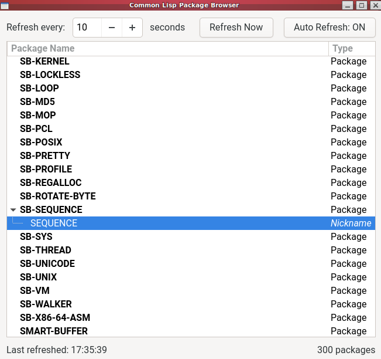

# Visual Packages

This started as a demo for myself to try and get a bit familiar with Gtk4 via https://github.com/crategus/cl-cffi-gtk4/

I also vibe-coded about 90% of it with Claude's help.

I was thinking to myself, I want to have a window up that shows me what packages are loaded into my Lisp instance, and it should refresh itself so when I
quickload something new it will show it. I also want it to show me package nicknames, if they have any, so I decided to make a tree view where packages with
nicknames can expand and you'll see the nicknames.

This turns out to be not that useful. So here are some next steps I want to try:

* Refactor to use GtkTreeListModel and friends, because TreeStore is deprecated
* Change the tree expansion to show exported symbols
    * This list is dynamic, and should auto-update even if the subtree is expanded if the user exports a new symbol in a package
    * Perhaps there's an option to expand to show all symbols, not just exported ones, too
    * Option to filter by function/non-function, but in any case each clearly labeled. Hover tooltip for doc.
* Add a hover tooltip that shows package documentation
* Add command buttons to do the following things:
    * Show nicknames
    * Show package-used-by cross-referencing information
    * Show the system this package came from (possibly instead change the tree view to show systems -> expanded to packages -> expanded to symbols, instead)
* Add a column showing when the package was recorded by this system, allowing to sort by package name or package-seen time. (This lets you see a historical list
  of packages added after single quickload commands, for instance, which might be useful?)
* Simple search box that just wraps apropos

# Running

Add this and the cl-cffi-gtk4 project and its several dependencies to your quicklisp local-projects, load this project with `(ql:quickload "visual-packages")`
and run `(com.thejach.visual-packages:main)`. You should see a new window pop up like the screenshot showing your loaded packages. It will be in its own thread
so you maintain control over your REPL.

# License

Public domain / unlicense

# Ramblings on making UIs

UI code kinda sucks and is terrible, it's a lot nicer in the web world. But outside the web world, desktop UI becomes a lot nicer when you have a visual design
tool. Qt has had one for a long time, but CL support for Qt is always out of date so I decided not to try using it and went with Gtk. There are two Gtk binding
projects for CL, the one linked is the better one.

The benefit of having a visual UI design tool is almost trivial to point out. You can interactively design the UI with your mouse and keyboard! I mean, it's
cool (when it works) that you can sort of do the same with Lisp's built in ability to be interactive, but once you're dealing with foreign libraries that
behavior rapidly breaks down without some effort into supporting it. And it's still often slower than just using the GUI tool. Anyway, once you're done, you
export the UI from the tool in some format you don't care about (it probably won't be as nice as CL code, but it's going to be ugly no matter what). Now, in
*any programming language*, you laod up that configuration file to build the UI and all you need to do now is connect any interactive elements with function
callbacks in your programming language of choice. This minimizes the UI-specific code considerably. (Once things are dynamic, UI-specific code comes back, but
it's at least less.)

I learned Gtk has a few visual design tools but one of them got deprecated quite some time ago and nowadays there's pretty much only https://gitlab.gnome.org/jpu/cambalache

Problem is it's only available as a pre-built executable through the Flathub/Flatpak infrastructure. Fine, but for whatever reason when I tried it I was unable
to properly import/export files despite the Flatpak supposedly having all the permissions it needs.

But apart from that, apparently a lot of people don't even use it anyway.

Instead a popular tool is Blueprint: https://gnome.pages.gitlab.gnome.org/blueprint-compiler/

All this is is a simpler markup language than the raw XML (.ui file) used by Gtk itself. Quite a few projects are built with it -- you create a .blp file (which
is CSS-like) and run the compiler on it to produce a .ui file (XML). You load the .ui file in your code.

Additionally there's the project Workbench: https://github.com/workbenchdev/Workbench  This is almost as good as something like Cambalache. It has a lot of
demos/examples showing you the Blueprint for some UI, you can easily swap back and forth to see the XML instead (and make changes to either and it can
reverse-compile XML to Blueprint form), and many things can update immediately in the preview to the right. Additionally there is a Code panel with code
examples in a variety of languages for how to hook up interactive elements like buttons to do something. This lets you run the preview as an actual application
and test things out interactively that way, too.

So this gives a straightforward way to make GUIs with CL and Gtk: create your UI with one of the above mentioned tools, load the XML with
`gtk:builder-add-from-file` as done near the bottom of this project's main.lisp file, pick out elements as needed for wiring up signals and such, and away you
go.

Even with the minor headaches to set everything up (including cloning cl-cffi-gtk4 and its several dependencies into your local projects as they're not on ql)
this is at least more enjoyable than having to write boilerplate code explicitly making things like hboxes and vboxes and blah blah and (old school) doing
things like `window.pack()`. Markup languages are so much better in almost all cases than the old procedural code, they're good even if they're not declarative
Lisp code. We should use them more.
